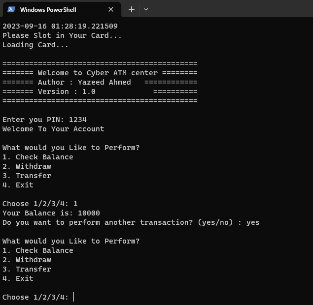

# ATM Simulator

Welcome to the ATM Simulator repository! This project is a simple ATM (Automated Teller Machine) simulator built using Python. It allows users to perform basic banking transactions and provides a glimpse into how ATM systems work.



## Table of Contents

- [Introduction](#introduction)
- [Features](#features)
- [Getting Started](#getting-started)
- [Usage](#usage)
- [Contributing](#contributing)
- [License](#license)

## Introduction

The ATM Simulator is a Python-based project designed to mimic the functionality of an ATM machine. Users can perform actions such as checking account balances, making withdrawals, depositing funds, and changing their PIN. This project is an educational tool for understanding basic banking operations and Python programming.

## Features

- Account balance inquiry
- Cash withdrawal and deposit
- PIN change functionality
- User-friendly command-line interface

## Getting Started

To run the ATM Simulator locally or explore the code, follow these steps:

1. Clone this repository to your local machine:

   ```bash
   git clone https://github.com/yourusername/atm-simulator-python.git
   cd ATM_SIMULATOR-
   python ATM.py
Follow the on-screen prompts to interact with the ATM simulator.

# Usage
1. Choose options from the menu to perform actions like checking balance, making withdrawals, depositing funds, or changing your PIN.
2. Follow the instructions provided by the simulator to complete transactions.

# Contributing
Contributions are welcome! If you'd like to improve the ATM Simulator or add new features, please follow these guidelines:

1. Fork this repository.

2. Create a new branch for your changes: git checkout -b feature/your-feature-name

3. Make your changes and test them thoroughly.

4. Commit your changes: git commit -m "Add your message here"

5. Push your changes to your forked repository: git push origin feature/your-feature-name

6. Create a pull request (PR) describing your changes.

Please maintain clear and well-documented code and ensure that the simulator remains user-friendly.

# License
This project is licensed under the MIT License. Feel free to use the code for educational and personal purposes.

Enjoy exploring and simulating ATM transactions!


